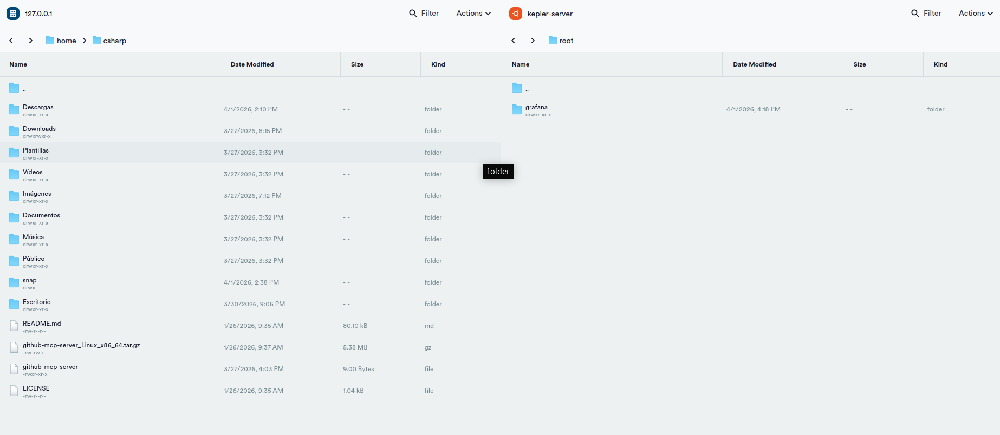

## IINSTALL SSH CONNECTION (BETWEEN LOCAL AND TERMIUS):

### 1. Install OpenSSH Server

In Ubuntu, the SSH server comes in the openssh-server package. To install it:
```
sudo apt update
sudo apt install openssh-server
```

### 2. Check that SSH is active

After you install it, make sure that the service is running:

```
sudo systemctl enable ssh   # Start SSH automatically at startup
sudo systemctl start ssh   # Start SSH now
sudo systemctl status ssh   # Check that it is active
```
**`The output should say active (running).`**

### 3. Confirm the SSH port

By default, OpenSSH uses port 22. To confirm:
```
cat /etc/ssh/sshd_config | grep Port
```
**`If you don’t see another modified line, use port 22 on Termius.`**

---

### CONNECTION:

#### In Termius:

1. Open **`SFTP`**

2. Establish a `Termius connection` (in the left or right window).
3. Establish a `local connection` (in the left or right window).
    - know PC user: **`whoiam`** in terminal
    - Know user password
4. Connect.


**`To add folders from one server to another, just drag it to the corresponding sale`**
