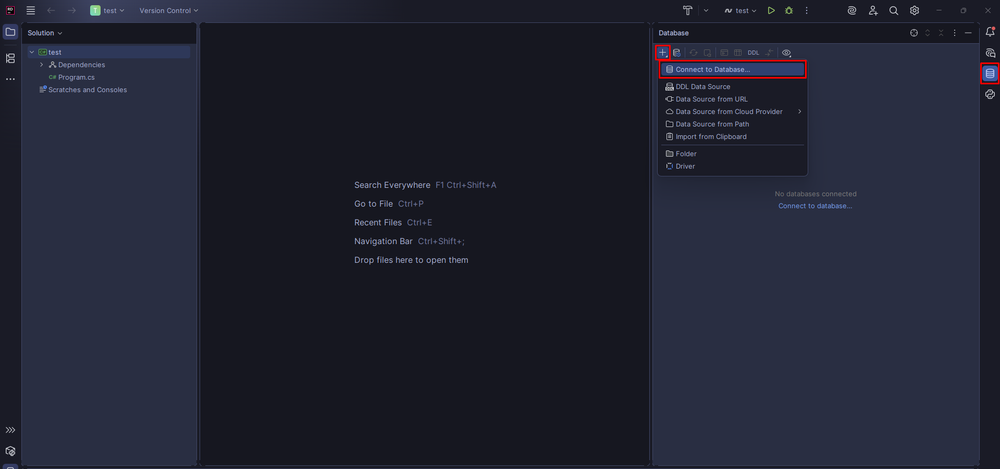
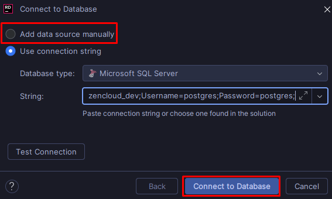
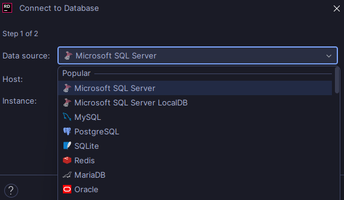
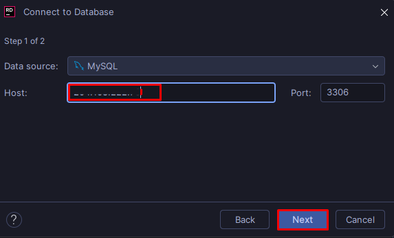
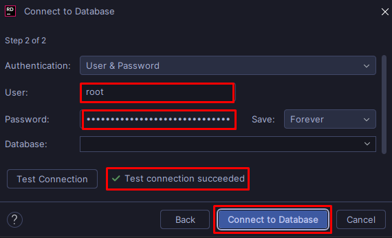

## Rider Connect to Database

### 1. Choose the data base :

- On the right side choose the database logo
- Click the + icon
- Choose the option (Connection to Database...)

### 2. Add data manually:

- Click the first chekpoint (Add data source manually)
- Click (Connect to Database)

### 3. Select the Database Manager:

- Select the database manager

### 4. Copy your host:

- On this case this must be the host (204.168.222.76)

### 5. Authenticate :

- Fill the first two rectangles with this values
- User: ``YOUR USER``
- Password: ``YOUR PASSWORD``
- Click test connection, If it is ok
- Click (Connect to Database)
