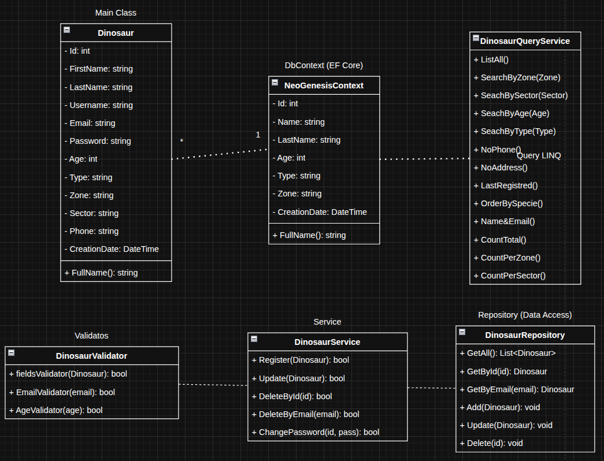
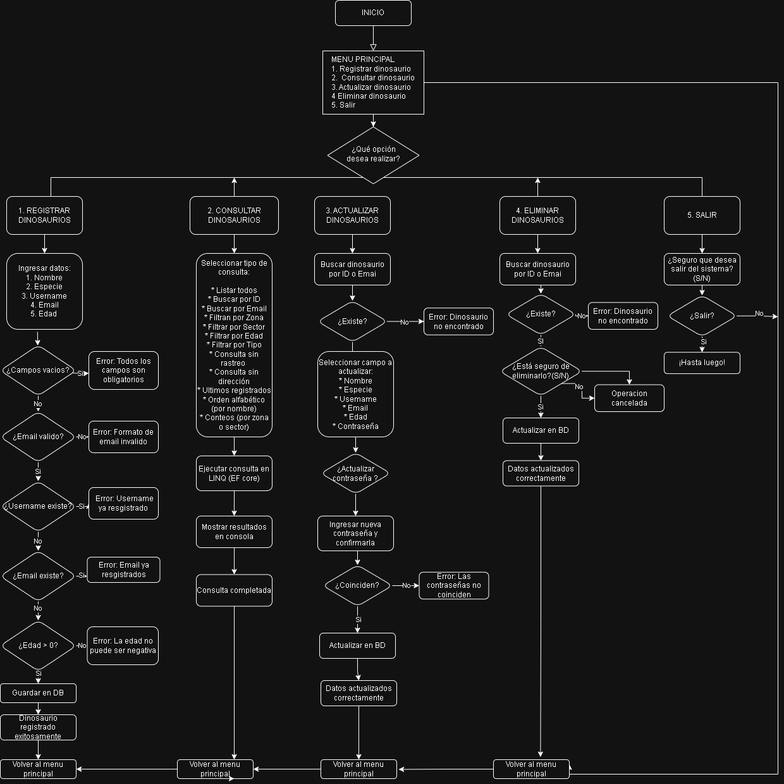
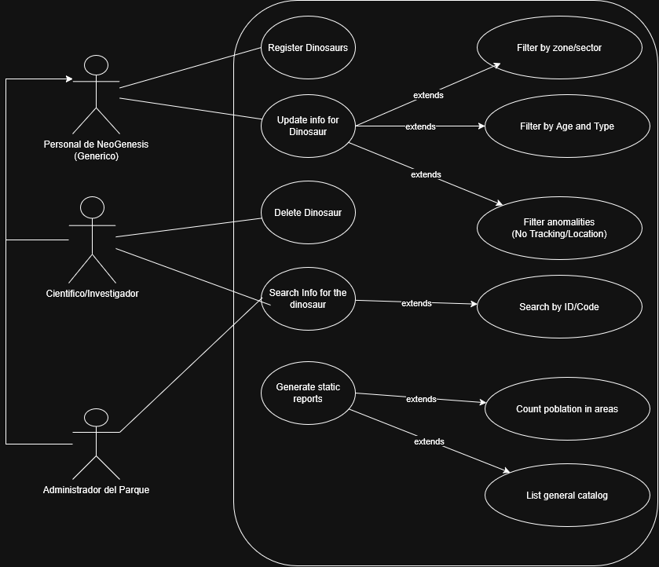
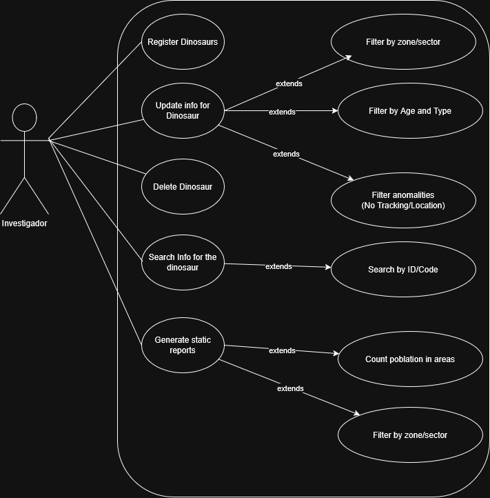

# NeoGenesis

## Dinosaur Registration System - NeoGenesis Park

### Excercice repository
```url
https://github.com/keplerC-sharp/NeoGenesis
```

## 1. General Description

The NeoGenesis Park system is designed to register, manage, and monitor dinosaurs created through genetic engineering within the park.

Each dinosaur has a unique identity that allows tracking, study, and control.

---

## Project Structure

```
NEOGENESIS
App
    |
    |_Data
        |_NeoGenesisContext.cs
    |
    |_Entities
        |_Dinosaur.cs
    |  
    |_Services
        |_DinosaurService.cs
    |
    |_Validators
        |_DinosaurValidator.cs
    |
    |_Repository
        |_DinosaurRepository.cs
    |
    |_LINQ
        |_DinosaurQueryService.cs
    |
    |_Program.cs

README.md
REQUESTS.md
.gitignore
```

## 2. System Objectives

- Register dinosaurs with required basic information
- Provide advanced query capabilities using LINQ
- Manage updates and deletion of records
- Ensure data integrity through validations
- Implement persistence using Entity Framework Core

---

## 3. System Architecture

The system follows a layered architecture:

- Entity Layer → Represents data (Dinosaur)
- Data Access Layer → (DbContext, Repository)
- Business Logic Layer → (Service)
- Query Layer → (QueryService)
- Validation Layer → (Validator)

---

## 4. Class Diagram Description




### 4.1 Class: Dinosaur

Represents the main entity of the system.

Attributes:
- Id: int
- FirstName: string (Assigned name)
- LastName: string (Species)
- Username: string (Unique identifier)
- Email: string (Registration code)
- Password: string
- Edad: int
- Tipo: string (Carnivore / Herbivore)
- Zona: string
- Sector: string
- Direccion: string
- Telefono: string
- FechaCreacion: DateTime

Methods:
- NombreCompleto(): string

---

### 4.2 Class: NeoGenesisContext

Database context using Entity Framework Core.
```
Properties:
- Dinosaurios: DbSet<Dinosaur>

Methods:
- OnModelCreating()

Responsibilities:
- Configure entities
- Define unique constraints (Username, Email)
```
---

### 4.3 Class: DinosaurRepository

Handles data access operations (CRUD).

Methods:
- GetAll()
- GetById(int id)
- GetByEmail(string email)
- Add(Dinosaur dino)
- Update(Dinosaur dino)
- Delete(int id)

---

### 4.4 Class: DinosaurService

Contains business logic.

Methods:
- Register(Dinosaur dino)
- Update(Dinosaur dino)
- DeleteById(int id)
- DeleteByEmail(string email)
- ChangePassword(int id, string password)

Responsibilities:
- Validate rules before persisting data
- Provide confirmation messages

---

### 4.5 Class: DinosaurQueryService

Implements advanced queries using LINQ.

Methods:
- GetAll()
- GetByZone(string zone)
- GetBySector(string sector)
- GetByMinimumAge(int age)
- GetByType(string type)
- GetWithoutTrackingDevice()
- GetWithoutLocation()
- GetRecentlyAdded()
- OrderBySpecies()
- GetNameAndEmail()
- CountAll()
- CountByZone()
- CountBySector()

---

### 4.6 Class: DinosaurValidator

Responsible for system validations.

Methods:
- ValidateFields(Dinosaur dino)
- ValidateEmail(string email)
- ValidateAge(int age)

Rules:
- Required fields must not be empty
- Email must have a valid format
- Age must be greater than or equal to 0
- Username must be unique
- Email must be unique

---

### 4.7. Relationships Between Classes

- NeoGenesisContext contains Dinosaur entities
- DinosaurRepository uses NeoGenesisContext
- DinosaurService uses Repository and Validator
- DinosaurQueryService uses NeoGenesisContext

---

## 5. Flowchart


### 5.1. Register Dinosaur

The user must enter the following fields: Name, Species, Username, Email, Age, Password, Type, Zone, Sector, and Phone.

The system validates each field in order:
- If any field is empty, it shows: "All fields are required."
- If the email format is invalid, it shows: "Invalid email format."
- If the username already exists, it shows: "Username already registered."
- If the email already exists, it shows: "Email already registered."
- If Age is 0 or below, it shows: "Age cannot be negative."

If all validations pass, the record is saved to the database and a success message is shown.

### 5.2. Consult Dinosaurs

The user selects a query type and the system executes it via LINQ (EF Core), then displays the results in the console.

Available query types:
- List all
- Search by ID
- Search by Email
- Filter by Zone
- Filter by Sector
- Filter by Age
- Filter by Type
- Query without tracking
- Query without direction
- Last registered
- Alphabetical order (by name)
- Counts (by zone or sector)

### 5.3. Update Dinosaur

The user searches for a dinosaur by ID or Email. If not found, the system shows: "Dinosaur not found."

If found, the user selects the field to update: Name, Species, Username, Email, Age, or Password.

If updating the password, the user must enter and confirm the new password. If they do not match, the system shows: "Passwords do not match."

If everything is valid, the record is updated in the database.

### 5.4. Delete Dinosaur

The user searches for a dinosaur by ID or Email. If not found, the system shows: "Dinosaur not found."

If found, the system asks for confirmation (Y/N). If the user declines, the operation is cancelled. If confirmed, the record is deleted from the database.

### 5.5. Exit

The system asks: "Are you sure you want to exit? (Y/N)". If the user confirms, the application ends. Otherwise, it returns to the main menu.

## Tech Stack

- Language: C#
- ORM: Entity Framework Core
- Query language: LINQ
- Interface: Console application

---

## 6. UML Use Case Diagrams



### 6.1. Basic Architecture (Single Actor Model)
**File:** `diagram_basic.png` / `diagram_basic.drawio`

This diagram represents the strict fulfillment of the base requirements. 
* **Actor:** `Investigator` (Generic Staff)
* **Description:** A single actor interacts with the entire system, handling all CRUD (Create, Read, Update, Delete) operations and report generation. It focuses on functional requirements without permission restrictions.

### 6.2. Advanced Architecture (Role-Based Access Control)
**File:** `diagram_advanced.png` / `diagram_advanced.drawio`

This diagram goes the "extra mile" by implementing a realistic organizational hierarchy and security permissions. It introduces actor generalization:
* **Base Actor:** `NeoGenesis Staff` (Inherits basic query and report generation access).
* **Actor 1: Scientist / Investigator:** Responsible for day-to-day operations. Can register new dinosaurs, update standard information, and run specific scientific queries.
* **Actor 2: Park Administrator:** Possesses elevated security clearances. This is the only role authorized to delete a dinosaur from the system or update sensitive security codes.

---

## ⚙️ Core System Features

The system modeled in these diagrams supports the following modules:

* **Insertion Module:** Registers new specimens with mandatory unique identifiers (Username, Email/Lab Code, Species, etc.).
* **Update Module:** Modifies specimen data and handles secure password/security code updates.
* **Deletion Module:** Removes specimens from the database requiring strict safety confirmations.
* **Query & Reporting Module (LINQ-ready):** * Filters specimens by Zone, Sector, Age, and Diet (Carnivore/Herbivore).
  * Tracks anomalies (e.g., specimens without active GPS trackers or registered locations).
  * Generates population statistics and chronological registration reports.

---
## 7. System Functionalities

### 7.1 Insertion
- Register new dinosaurs
- Validate uniqueness of Username and Email
- Confirm successful creation

### 7.2 Update
- Modify dinosaur data
- Update password with confirmation

### 7.3 Deletion
- Delete by Id or Email
- Require confirmation before deletion

### 7.4 Queries (LINQ)

Basic:
- List all dinosaurs
- Filter by zone or sector
- Filter by age or type

Projections:
- Full name and email

Sorting:
- By creation date
- Alphabetically

Grouping:
- Count by zone
- Count by sector

Advanced Filters:
- Dinosaurs without tracking device
- Dinosaurs without location
- Recently registered dinosaurs

---

## 8. Technical Requirements

- Language: C#
- ORM: Entity Framework Core
- Database: SQL Server or similar

---

## 9. Migrations (EF Core)

### Environment Variables (Way 1)
Edit Your bash File (Linux)
```bash
nano ~/.bashrc
```
Add at the end of the file
```bash
export DB_HOST=localhost
export DB_NAME=dinosaurs_db
export DB_USER=root
export DB_PASSWORD=tu_password
```
Save and close AND save changes in the evironment
```
source ~/.bashrc
```
---

### Environment Variables (Way 2)
Quickly option on terminal
```bash
export DB_HOST=localhost
export DB_NAME=dinosaurs_db
export DB_USER=root
export DB_PASSWORD=tu_password
```
**This is lost when you close the terminal**

---

Afther all this commands
Add-Migration InitialCreate
```bash
dotnet ef migrations add InitialCreate
```
Update-Database
```bash
dotnet ef database update
```
---

## 10. Best Practices Applied
- Separation of concerns
- Clean and readable code
- Use of design patterns (Repository, Service)
- Centralized validations
- LINQ for querying

## 11. Possible Improvements
- Authentication and authorization
- Movement history tracking
- Real-time sensor integration
- REST API implementation

## 12. Conclusion

The proposed system provides an efficient, scalable, and reliable solution for managing dinosaur records within NeoGenesis Park, fulfilling all functional and technical requirements.
